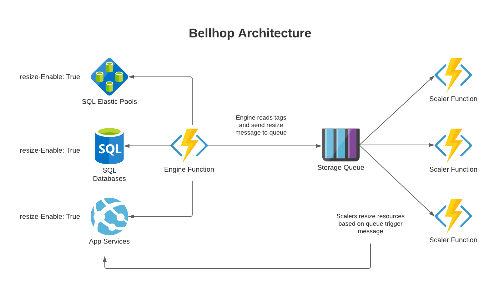

# Bellhop

<!-- 
Guidelines on README format: https://review.docs.microsoft.com/help/onboard/admin/samples/concepts/readme-template?branch=master

Guidance on onboarding samples to docs.microsoft.com/samples: https://review.docs.microsoft.com/help/onboard/admin/samples/process/onboarding?branch=master

Taxonomies for products and languages: https://review.docs.microsoft.com/new-hope/information-architecture/metadata/taxonomies?branch=master
-->

This project was born out of the customer need to save money, and a gap in Azure's ability to easily "turn down" Managed services in Dev/Test environments. Particularly when referring to scaling between service tiers. We put our heads together and came up with a serverless option to adress this issue built almost entirely around Azure Functions. Bellhop is comprised of 2 separate Azure Functions; one is the Engine written in C#, and the other is the Scaler-Trigger. Users will need to tag their resources with the required tags (covered below), and the Engine Function will then use those tags to determine which resources need to be scaled, to which tiers, and when. The Engine will then post a scale instruction message in the Storage Queue, at which time the Scaler-Trigger Function will pull the message from the queue and begin processing the scale request. The Scaler-Trigger function leverages custom scaler modules per resource type to fufill the scale request.

## Repo Contents

| File/folder       | Description                                |
|-------------------|--------------------------------------------|
| `arm-templates/`   | Bellhop Infrastructure ARM Template.      |
| `azure-functions/` | Bellhop project Azure Functions. Includes Engine and Trigger.|
| `docs/`            | Docsify repo for web documentation.|
| `.gitignore`      | Define what to ignore at commit time.      |
| `deploy.ps1`      | PowerShell script to deploy tool.          |
| `README.md`       | This README file.                          |
| `teardown.ps1`    | PowerShell script to decommission the tool. Makes testing and experimentation easy.|
| `CHANGELOG.md`    | List of changes to the sample. COMING SOON!|
| `CONTRIBUTING.md` | Guidelines for contributing to the sample. COMING SOON!|
| `LICENSE`         | The license for the sample. COMING SOON!   |


## Bellhop Architecture and Workflow




## Prerequisites

To successfully deploy this project, it requires the Azure user have the following:

- Azure AD Role allowing user to assign roles (Global Admin, App Admin, Cloud App Admin)
    - *necessary to assign proper scope to managed identity*
- Azure RBAC role of Owner or Contributor at the Subscription scope
- Azure Subscription
- Powershell installed


## Current Supported Azure Services

The list of services currently supported by Bellhop:
- App Service Plans
- SQL Database
- SQL Elastic Pools
- Virtual Machine (COMING SOON!!!!)


## Deploying Bellhop

### Steps to deploy infrastructure:

- Clone the GitHub repo down to your local machine
- Run `deploy.ps1` from project root

The deployment script will ask the user to input a unique name for their deployment, as well as their desired Azure region. These will be passed to the script as parameters. 

Example:
```
PS /User/git_repos/github/azure-autoscale> ./deploy.ps1
Enter a unique name for your deployment: tjptest
Enter Azure Region to deploy to: westus
```

### Steps to tear down the deployment:
- Run `teardown.ps1` from project root
    - Script will ask user for a Resource Group Name, and then delete that resource group and all associated resources
    

## Running Bellhop
Bellhop is currently configured to run in the context of a single subscription, and relies on the Graph API and certian Tags on resources to handle service tier scaling for you! The Engine will query Graph API every 5 min (by default) and perform a get on resources tagged with `resize-Enable = True`. If resize has been enabled, and times have been configured, the Engine will determine which direction the resource would like to scale and send a message to the storage queue. 

All you need to do to run Bellhop is deploy the solution and ensure you have the proper tags set, and Bellhop will take care of the rest! 


## Required Tags for all services
Bellhop operates based on service tags. Some of the required tags will be common between Azure services, and some tags will be specific to the resource you would like Bellhop to scale. Resource specific tags will be discussed in detail on that resources page: [Scaler Modules](./docs/scalers/modules/)

Bellhop Common Tags:
```
resize-Enable = <bool> (True/False)
resize-StartTime = <DateTime> (Friday 7PM)
resize-EndTime = <DateTime> (Monday 7:30AM)
```
_**NOTE: StartTime and EndTime are currently in UTC**_

## Bellhop Infrastructure

### So, what does this solution actually deploy?

The included deploy script, `deploy.ps1`, will build the following infrastructure:
- **Resource Group** 
    - You _can_ bring an existing resource group
    - Deployment will create a new resource group if one does not already exist
- **System Assigned Managed Identity**
    - Managed Identity for the App Service Plan will have Contributor rights to the Subscription
- **Azure Storage Account**
    - Storage for Azure Function App Files
    - Storage Queue for Function Trigger
- **Azure App Service Plan**
    - Windows App Service Plan to host Powershell Function Apps
        - Scaler Function App
            - Scaler modules
        - Engine Function App
- **Zip Deploy Function Package** 
    - Deploy Function Zip packages to the Function App
- **Azure Application Insights**
    - App Insights for App Service Plan


### Security considerations
For the purpose of this proof of concept we have not integrated security features into Bellhop as is being deployed through this workflow. This solution is a Proof Of Concept and is not secure, it is only recommended for testing. To use this service in a production deployment it is recommended to review the following documentation from Azure. It walks though best practices on securing Azure Functions: 
[Securing Azure Functions](https://docs.microsoft.com/en-us/azure/azure-functions/security-concepts)

**_IT IS RECOMMENDED TO USE AVAILABLE SECURITY CONTROLS IN A PRODUCTION DEPLOYMENT_**

## FAQ

**Why would I use Bellhop?**

You realize that by "turning down" your resources in Dev/Test environments you could save a lot of money. You also realize there is not currently an an easy way to scale service tiers on Azure PaaS services. Bellhop to the rescue!!!! Tag your resources with scale times and desired "simmer" settings and Bellhop will take care of the rest!

**What does the roadmap for Bellhop look like?**

We would like this to become a SaaS/PaaS product that will help to keep our customers costs under control in Dev/Test Environments. 

**Who are the awesome people that built this solution??**

Matt, Nills, and Tyler are Cloud Solutions Architects at Microsoft, and are always looking for interesting ways to help our customers solve problems!

**Want to know more about Bellhop??**

## Contributing

This project welcomes contributions and suggestions.  Most contributions require you to agree to a
Contributor License Agreement (CLA) declaring that you have the right to, and actually do, grant us
the rights to use your contribution. For details, visit https://cla.opensource.microsoft.com.

When you submit a pull request, a CLA bot will automatically determine whether you need to provide
a CLA and decorate the PR appropriately (e.g., status check, comment). Simply follow the instructions
provided by the bot. You will only need to do this once across all repos using our CLA.

This project has adopted the [Microsoft Open Source Code of Conduct](https://opensource.microsoft.com/codeofconduct/).
For more information see the [Code of Conduct FAQ](https://opensource.microsoft.com/codeofconduct/faq/) or
contact [opencode@microsoft.com](mailto:opencode@microsoft.com) with any additional questions or comments.
