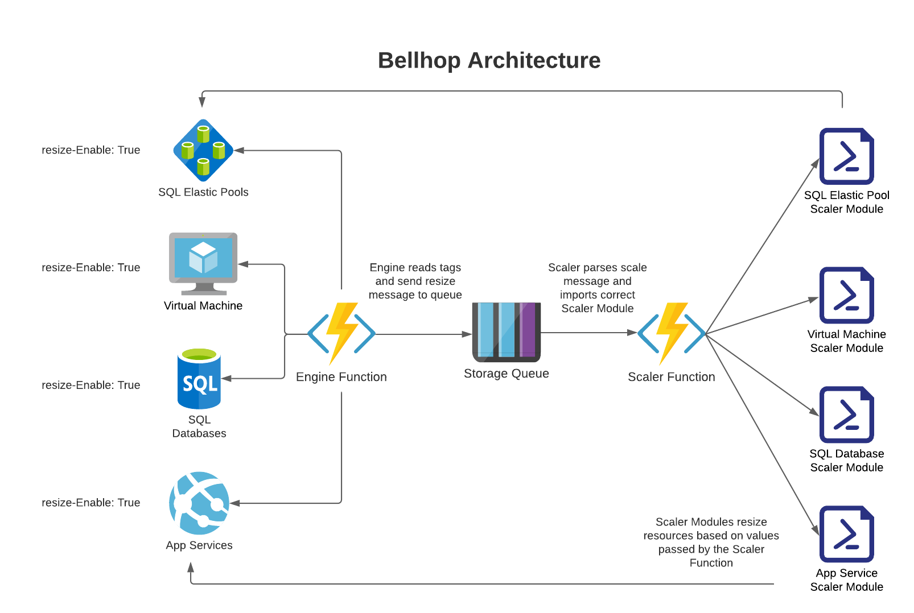

# Welcome to Bellhop!

<!-- 
Guidelines on README format: https://review.docs.microsoft.com/help/onboard/admin/samples/concepts/readme-template?branch=master

Guidance on onboarding samples to docs.microsoft.com/samples: https://review.docs.microsoft.com/help/onboard/admin/samples/process/onboarding?branch=master

Taxonomies for products and languages: https://review.docs.microsoft.com/new-hope/information-architecture/metadata/taxonomies?branch=master
-->

## Bellhop Overview and Architecture
This project was born out of the desire to be resource conscious and to fill a gap in Azure's native ability to easily scale managed services between service tiers. Bellhop provides a highly extensible framework, that is completely serverless in design leveraging Azure Functions, Storage Queues, and resource tags. Users just need to tag their resources with the required tags (covered below) and the Engine function will then query the Graph API, use those tag values to determine which resources need to be scaled, to which tier, and when. The Engine then posts a scale message in a predefined Storage Queue, triggering the Scaler function to pull the message from the queue and begin processing the scale request. The Scaler function itself is very lightweight and it is only used to import and pass parameter values to the correct Scaler Module, which handles each scaling operation. Every Azure resource that will be scaled will need a dedicated Scaler Module. All that users needs to do to extend this solution to any new Azure resources is write a new Scaler Module for that service, the Engine and Scaler Function code should rarely change.




## Prerequisites
To successfully deploy this project, it requires the Azure user have the following:

- Azure AD Role allowing user to assign roles (Global Admin, App Admin, Cloud App Admin)
    - *Necessary to assign proper scope to managed identity*
- Azure RBAC role of Owner or Contributor at the Subscription scope
- Azure Subscription
- Powershell 7.0+
- Azure PowerShell 5.6+
- .NET 3.1 SDK


## Currently Supported Azure Services
The list of scalers currently supported by Bellhop:
- App Service Plan
- SQL Database
- SQL Elastic Pool
- Virtual Machine

## Deploying/Updating/Deleting Bellhop
### Steps to deploy infrastructure:
- Clone the [GitHub repo](https://github.com/Azure/Bellhop) down to your local machine

Example:
```
PS /User/github/> git clone https://github.com/Azure/bellhop.git
```

- Run `deployBellhop.ps1` from project root

The deployment script will ask the user to input a unique name for their deployment, as well as their desired Azure region. These will be passed to the script as parameters. 

Example:
```
PS /User/github/bellhop> ./deployBellhop.ps1
Enter a unique name for your deployment: bellhop
Enter Azure Region to deploy to: westus2
```

### Steps to update the Scaler Function when adding custom scaler modules:
- Run `updateScaler.ps1` from project root

The update script will ask the user for a Resource Group name, and then zip deploy the updates to the Scaler function deployed in the given resource group.

Example:
```
PS /User/github/Azure/bellhop> ./updateScaler.ps1
Enter resource group name where function is deployed: bellhop-rg 
```

### Steps to tear down the deployment:
- Run `removeBellhop.ps1` from project root

The teardown script will ask the user for a Resource Group name, and then delete that Resource Group and all associated resources. 

Example:
```
PS /User/github/Azure/bellhop> ./removeBellhop.ps1
Enter name of resource group to teardown: bellhop-rg
``` 

## Running Bellhop
Bellhop is currently configured to run in the context of a single subscription, and relies on the Graph API and certian Tags on resources to handle service tier scaling for you! The Engine will query Graph API every 5 min (by default) and perform a get on resources tagged with `resize-Enable = True`. If resize has been enabled, and start/end times have been configured, the Engine will determine which direction the resource would like to scale and send a message to the storage queue.

All you need to do to run Bellhop is deploy the solution and ensure you have the proper tags set on your resources, and Bellhop will take care of the rest! 


## Required Tags for All Services
Bellhop operates based on resource tags. Some of the required tags will be common between Azure services, and some tags will be specific to the resource you would like Bellhop to scale. Resource specific tags will be discussed in detail in the [Scaler Modules](/scaler/modules/README.md) section.

Bellhop Common Tags:
```
resize-Enable = <bool> (True/False)
resize-StartTime = <DateTime> (Friday 7PM)
resize-EndTime = <DateTime> (Monday 7:30AM)
```

_**NOTE: StartTime and EndTime are currently in UTC**_


## Bellhop Infrastructure
### What gets deployed with Bellhop?

The included deploy script, `deployBellhop.ps1`, will build out the following Azure infrastructure:
- **Resource Group** 
    - You _can_ bring an existing resource group
    - Deployment will create a new resource group if one does not already exist
- **System Assigned Managed Identity**
    - Managed Identity for the App Service Plan will have Contributor rights to the Subscription
- **Azure Storage Account**
    - Storage for Azure Function App Files
    - Storage Queue for Function Trigger
- **Azure App Service Plan**
    - Windows App Service Plan to host Function Apps
        - Scaler Function App (PowerShell)
            - Scaler modules
        - Engine Function App (.NET)
- **Zip Deploy Function Package** 
    - Deploy Function Zip packages to the Function Apps
- **Azure Application Insights**
    - App Insights for App Service Plan

### Security considerations
For the purpose of this project we have not integrated a complete set of security features into Bellhop. This solution is currently in an alpha phase and is not hardened from a security aspect. To use this service in a production deployment it is recommended to review the following documentation from Azure. It walks though best practices on securing Azure Functions: 
[Securing Azure Functions](https://docs.microsoft.com/en-us/azure/azure-functions/security-concepts)

**_IT IS RECOMMENDED TO USE AVAILABLE SECURITY CONTROLS IN A PRODUCTION DEPLOYMENT_**


## FAQ
**Why would I use Bellhop?**

You realize that by "turning down" your resources in Dev/Test environments you could save a lot on the cost of your infrastructure. You also realize there is not currently an easy way to scale between service tiers on Azure PaaS services. Bellhop to the rescue!!!! Tag your resources with scale times and desired service tier settings and let Bellhop take care of the rest!

**What does the roadmap for Bellhop look like?**

We would like this to become a SaaS/PaaS product that will help to keep Azure infrastructure costs under control in Dev/Test Environments. 

**Who are the awesome people that built this solution??**

Matt, Nills, and Tyler are Cloud Solutions Architects at Microsoft, and are always looking for interesting ways to help our customers solve problems.

**Want to know more about Bellhop??**

Please feel free to reach out to <bellhop@microsoft.com> with any questions or feedback.


## Contributing
This project welcomes contributions and suggestions.  Most contributions require you to agree to a
Contributor License Agreement (CLA) declaring that you have the right to, and actually do, grant us
the rights to use your contribution. For details, visit https://cla.opensource.microsoft.com.

When you submit a pull request, a CLA bot will automatically determine whether you need to provide
a CLA and decorate the PR appropriately (e.g., status check, comment). Simply follow the instructions
provided by the bot. You will only need to do this once across all repos using our CLA.

This project has adopted the [Microsoft Open Source Code of Conduct](https://opensource.microsoft.com/codeofconduct/).
For more information see the [Code of Conduct FAQ](https://opensource.microsoft.com/codeofconduct/faq/) or
contact [opencode@microsoft.com](mailto:opencode@microsoft.com) with any additional questions or comments.
