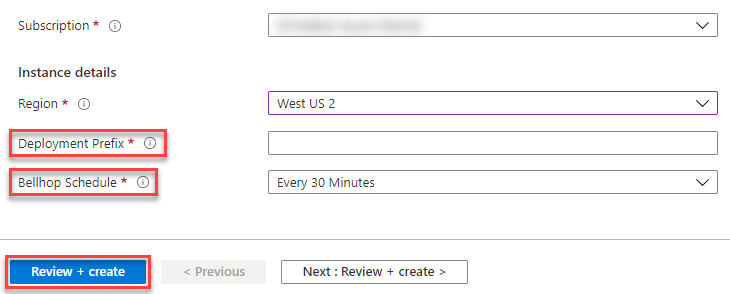

# Welcome to Bellhop!

<!-- 
Guidelines on README format: https://review.docs.microsoft.com/help/onboard/admin/samples/concepts/readme-template?branch=master

Guidance on onboarding samples to docs.microsoft.com/samples: https://review.docs.microsoft.com/help/onboard/admin/samples/process/onboarding?branch=master

Taxonomies for products and languages: https://review.docs.microsoft.com/new-hope/information-architecture/metadata/taxonomies?branch=master
-->

## Bellhop Overview and Architecture
This project was born out of the desire to be resource conscious and to fill a gap in Azure's native ability to easily scale managed services between service tiers. Bellhop provides a highly extensible framework, that is completely serverless in design leveraging Azure Functions, Storage Queues, and resource tags. Users just need to tag their resources with the required tags (covered below) and the Engine function will then query the Graph API, use those tag values to determine which resources need to be scaled, to which tier, and when. The Engine then posts a scale message in a predefined Storage Queue, triggering the Scaler function to pull the message from the queue and begin processing the scale request. The Scaler function itself is very lightweight and it is only used to import and pass parameter values to the correct Scaler Module, which handles each scaling operation. Every Azure resource that will be scaled will need a dedicated Scaler Module. All that users needs to do to extend this solution to any new Azure resources is write a new Scaler Module for that service, the Engine and Scaler Function code should rarely change.


## Prerequisites
To successfully deploy this project, it requires the Azure user have the following:

- Azure Subscription
- Azure RBAC Role at the Subscription scope of:
    - Owner
    - Contributor + User Access Aministrator 


## Currently Supported Azure Services
The list of scalers currently supported by Bellhop:
- App Service Plan
- SQL Database
- SQL Elastic Pool
- Virtual Machine

## Deploying Bellhop
### Steps to deploy Bellhop infrastructure:
1. Deploy directly to Azure using the button below

[](https://portal.azure.com/#create/Microsoft.Template/uri/https%3A%2F%2Fraw.githubusercontent.com%2FAzure%2Fbellhop%2Fmain%2Ftemplates%2Fazuredeploy.json/createUIDefinitionUri/https%3A%2F%2Fraw.githubusercontent.com%2FAzure%2Fbellhop%2Fmain%2Ftemplates%2FcreateUiDefinition.json)

2. Provide the required values in the deployment template, then click 'Review + Create'



## Running Bellhop
Bellhop is currently configured to run in the context of a single subscription, and relies on the Graph API and certian Tags on resources to handle service tier scaling for you! The Engine will query Graph API every 5 min (by default) and perform a get on resources tagged with `resize-Enable = True`. If resize has been enabled, and start/end times have been configured, the Engine will determine which direction the resource would like to scale and send a message to the storage queue.

All you need to do to run Bellhop is deploy the solution and ensure you have the proper tags set on your resources, and Bellhop will take care of the rest! 


## Required Tags for All Services
Bellhop operates based on resource tags. Some of the required tags will be common between Azure services, and some tags will be specific to the resource you would like Bellhop to scale. Resource specific tags will be discussed in detail in the [Scaler Modules](/scaler/modules/README.md) section.

Bellhop Common Tags:
```
resize-Enable = <bool> (True/False)
resize-StartTime = <DateTime> (Friday 7PM)
resize-EndTime = <DateTime> (Monday 7:30AM)
```

_**NOTE: StartTime and EndTime are currently in UTC**_


## Bellhop Infrastructure Overview
### What gets deployed with Bellhop?

The included deploy script, `deployBellhop.ps1`, will build out the following Azure infrastructure:
- **Resource Group** 
    - You _can_ bring an existing resource group
    - Deployment will create a new resource group if one does not already exist
- **System Assigned Managed Identity**
    - Managed Identity for the Engine Function App will have the following permissions
        - &lt;Reader&gt; on the target Subscription
        - &lt;App Configuration Data Reader&gt; on the App Configuration resource
        - &lt;Queue Data Message Sender&gt; on the Storage Account resource
    - Managed Identity for the Scaler Function App will have the following permissions
        - &lt;Contributor&gt; on the Subscription
- **Storage Account**
    - Storage for Azure Function App Files
    - Storage Queue for Function Trigger
- **App Service Plan**
    - Linux App Service Plan to host Function Apps
        - Engine Function App (.NET Core)
        - Scaler Function App (PowerShell)
- **Docker Function & Scaler Containers** 
    - Engine & Scaler code is deployed via Docker containers from the 'azurebellhop' DockerHub repo
- **Application Insights**
    - Application Insights for the above App Service Plan

### Security considerations
For the purpose of this project we have not integrated a complete set of security features into Bellhop. This solution is currently in an alpha phase and is not hardened from a security aspect. To use this service in a production deployment it is recommended to review the following documentation from Azure. It walks though best practices on securing Azure Functions: 
[Securing Azure Functions](https://docs.microsoft.com/en-us/azure/azure-functions/security-concepts)

**_IT IS RECOMMENDED TO USE AVAILABLE SECURITY CONTROLS IN A PRODUCTION DEPLOYMENT_**


## Questions or Comments?
The Bellhop team welcomes engagement and contributions from the community. We have set up a GitHub Discussions page [here](https://github.com/Azure/bellhop/discussions) to make it easy to engage with the Bellhop team without opening an issue.

Also, feel free to email us at bellhop@microsoft.com with any questions or comments and we will respond as soon as we can. 


## Contributing
This project welcomes contributions and suggestions.  Most contributions require you to agree to a
Contributor License Agreement (CLA) declaring that you have the right to, and actually do, grant us
the rights to use your contribution. For details, visit https://cla.opensource.microsoft.com.

When you submit a pull request, a CLA bot will automatically determine whether you need to provide
a CLA and decorate the PR appropriately (e.g., status check, comment). Simply follow the instructions
provided by the bot. You will only need to do this once across all repos using our CLA.

This project has adopted the [Microsoft Open Source Code of Conduct](https://opensource.microsoft.com/codeofconduct/).
For more information see the [Code of Conduct FAQ](https://opensource.microsoft.com/codeofconduct/faq/) or
contact [opencode@microsoft.com](mailto:opencode@microsoft.com) with any additional questions or comments.
