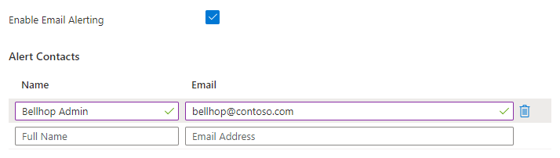

# Welcome to Bellhop!

<!-- 
Guidelines on README format: https://review.docs.microsoft.com/help/onboard/admin/samples/concepts/readme-template?branch=master

Guidance on onboarding samples to docs.microsoft.com/samples: https://review.docs.microsoft.com/help/onboard/admin/samples/process/onboarding?branch=master

Taxonomies for products and languages: https://review.docs.microsoft.com/new-hope/information-architecture/metadata/taxonomies?branch=master
-->

## Bellhop Overview and Architecture
This project was born out of the desire to be resource conscious and to fill a gap in Azure's native ability to easily scale managed services between service tiers. Bellhop provides a highly extensible framework, that is completely serverless in design leveraging Azure Functions, Storage Queues, and resource tags. Users just need to tag their resources with the required tags (covered below) and the Engine function will then query the Graph API, use those tag values to determine which resources need to be scaled, to which tier, and when. The Engine then posts a scale message in a predefined Storage Queue, triggering the Scaler function to pull the message from the queue and begin processing the scale request. The Scaler function itself is very lightweight and it is only used to import and pass parameter values to the correct Scaler Module, which handles each scaling operation. Every Azure resource that will be scaled will need a dedicated Scaler Module. All that users needs to do to extend this solution to any new Azure resources is write a new Scaler Module for that service, the Engine and Scaler Function code should rarely change.


## Prerequisites
To successfully deploy this project, it requires the Azure user have the following:

- Azure Subscription
- Azure RBAC Role at the Subscription scope of:
    - Owner
    - Contributor + User Access Aministrator 


## Currently Supported Azure Services
The list of scalers currently supported by Bellhop:
- App Service Plan
- SQL Database
- SQL Elastic Pool
- Virtual Machine

## Deploying Bellhop
### Steps to deploy Bellhop infrastructure:
1. Deploy directly to Azure using the button below.

[](https://portal.azure.com/#create/Microsoft.Template/uri/https%3A%2F%2Fraw.githubusercontent.com%2FAzure%2Fbellhop%2Fmain%2Ftemplates%2Fazuredeploy.json/createUIDefinitionUri/https%3A%2F%2Fraw.githubusercontent.com%2FAzure%2Fbellhop%2Fmain%2Ftemplates%2FcreateUiDefinition.json)


2. Provide the required values in the deployment template, then click 'Next' to proceed to the Advanced settings, or click 'Review + Create' to accept the default Bellhop values.


3. You can optionally override the default tag values that Bellhop uses to any custom values of your choice. Additionally, you can define a tag 'prefix' which will prepend all other tags, as well as enable basic Azure alerts for Bellhop failures. Click 'Review + Create' to proceed.


## Running Bellhop
Bellhop is currently configured to run in the context of a single subscription, and relies on the Graph API and certian Tags on resources to handle service tier scaling for you! The Engine will query Graph API every 5 min (by default) and perform a get on resources tagged with `resize-Enable = True`. If resize has been enabled, and start/end times have been configured, the Engine will determine which direction the resource would like to scale and send a message to the storage queue.

All you need to do to run Bellhop is deploy the solution and ensure you have the proper tags set on your resources, and Bellhop will take care of the rest! 


## Required Tags for All Services
Bellhop operates based on resource tags. Some of the required tags will be common between Azure services, and some tags will be specific to the resource you would like Bellhop to scale. Resource specific tags will be discussed in detail in the [Scaler Modules](/scaler/modules/README.md) section.

_Note: The following tags represent the **default** values that Bellhop provides. Custom tag options are discussed [below](#custom-tag-values)_.

**Bellhop Common Tags:**
```
resize-Enable = <bool> (True/False)
resize-StartTime = <DateTime> (Friday 7PM)
resize-EndTime = <DateTime> (Monday 7:30AM)
```

### StartTime & EndTime Tags
What does 'StartTime' & 'EndTime' represent?
- The `StartTime` tag represents when Bellhop will scale _**DOWN**_ the target resource (saves the current state)
- The `EndTime` tag represents when Bellhop will scale _**UP**_ the target resource (reverts to saved state)

Can you provide some examples of how to format the expected timestamp?
- The expected format is `<DayOfWeek> <TimeOfDay>`
    - `<TimeOfDay>` is the time, based on the 12HR clock, which can be simply the hour, or hour + minutes
    - Hour Only: `resize-StartTime = Monday 7PM`
    - Hour + Minutes: `resize-StartTime = Friday 9:30AM`

Are the timestamps in a specific timezone, or can I select a timezone?
- All timestamps are in UTC format
- There are many complexities involved in supporting individual timezones, however this functionailty may come in the future
    - Please feel free to discuss your specific requirements around this on our [GitHub Discussions](https://github.com/Azure/bellhop/discussions) page

Can I have Bellhop resize Daily/Weekly/Monthly?
- Currently, we do support using the word `Daily` in place of the `<DayOfWeek>` which will trigger the resize action on a daily basis
- When using the `Daily` value, you must use `Daily` in both tags ( you cannot mix `Daily` and `<DayOfWeek>`)
- Example usage:
    - `resize-StartTime = Daily 8PM`
    - `resize-EndTime = Daily 6AM`
    - The net effect of example tag combination above, is that the target resource would be scaled down every evening at 8PM, and then scaled back up every morning at 6AM (UTC)
- Additional values such as `Weekly` or `Monthly` may be added in the future
    - If you have a specific use case or requirement for these additional keywords, please share with us on our [GitHub Discussions](https://github.com/Azure/bellhop/discussions) page

### Custom Tag Values
As discussed in the [Deploying Bellhop](#deploying-bellhop) section above, the Bellhop team recognizes that the default tags may not be a good fit for all customer evironments, so users have the ability to customize the operational tags used within Bellhop. When deploying Bellhop, customers can modify the fields located on the `Advanced` tab in the portal to set their own values for:
- **Tag Prefix**
    - _Prefix which will be appended to all tags used by Bellhop (NOTE: This prefix will be pre-pended to ALL of the below tags)_
- **Enable Tag**
    - _Tag which will be used to identify which resources are currently enabled for Bellhop scaling_
- **Start Time Tag**
    - _Tag which will be used to identify the day of the week (or Daily) & time which Bellhop should scale **DOWN** the resource_
- **End Time Tag**
    - _Tag which will be used to identify the day of the week (or Daily) & time which Bellhop should scale **UP** the resource_
- **Target State Prefix**
    - _Tag prefix which will be used for Bellhop to identify configuration elements of the target resource, which describe it's target state when scaled down_
- **Saved State Prefix**
    - _Tag prefix which will be used for Bellhop to rememebr configuration elements of the target resource, after the resource has been scaled down_

These custom tag values will be used to construct the Tag Map object to pass the Scaler function and module. If no fields are modified on the `Advanced` tab when deploying, the default tag values will be used. 

## Bellhop Infrastructure Overview
### What gets deployed with Bellhop?

When initially deploying Bellhop, you can expect the following resources to be included:
- **Resource Group** 
    - You _can_ bring an existing resource group
    - Deployment will create a new resource group if one does not already exist
- **System Assigned Managed Identity**
    - Managed Identity for the Engine Function App will have the following permissions
        - &lt;Reader&gt; on the target Subscription
        - &lt;App Configuration Data Reader&gt; on the App Configuration resource
        - &lt;Queue Data Message Sender&gt; on the Storage Account resource
    - Managed Identity for the Scaler Function App will have the following permissions
        - &lt;Contributor&gt; on the Subscription
- **Storage Account**
    - Storage for Azure Function App Files
    - Storage Queue for Function Trigger
- **App Service Plan**
    - Linux App Service Plan to host Function Apps
        - Engine Function App (.NET Core)
        - Scaler Function App (PowerShell)
- **Docker Function & Scaler Containers** 
    - Engine & Scaler code is deployed via Docker containers from the 'azurebellhop' DockerHub repo
- **Application Insights**
    - Application Insights for the above App Service Plan
- **App Configuration**
    - App configuration store for Bellhop runtime variables
        - Allows for configuration adjustments to Bellhop without the need to redeploy
            - Custom tag prefix values
            - Storage account/queue settings
            - Debug flag for troubleshooting

#### Optional Alerting
During the deployment process, the user also has the option to deploy additional alerting infrastructure that will be used to send notifications in the event of any Bellhop errors. The user will need to check the box to enable email alerting, and then enter the names and email addresses of the users that will need to receive the notifications:



**_Please see the [Monitoring & Alerting](/monitoring/README.md) section in the documentation for more details_**


### Security considerations
For the purpose of this project we have not integrated a complete set of security features into Bellhop. This solution is currently in an alpha phase and is not hardened from a security aspect. To use this service in a production deployment it is recommended to review the following documentation from Azure. It walks though best practices on securing Azure Functions: 
[Securing Azure Functions](https://docs.microsoft.com/en-us/azure/azure-functions/security-concepts)

**_IT IS RECOMMENDED TO USE AVAILABLE SECURITY CONTROLS IN A PRODUCTION DEPLOYMENT_**


## Questions or Comments
The Bellhop team welcomes engagement and contributions from the community. We have set up a GitHub Discussions page [here](https://github.com/Azure/bellhop/discussions) to make it easy to engage with the Bellhop team without opening an issue.

Also, feel free to email us at bellhop@microsoft.com with any questions or comments and we will respond as soon as we can. 


## Contributing
This project welcomes contributions and suggestions.  Most contributions require you to agree to a
Contributor License Agreement (CLA) declaring that you have the right to, and actually do, grant us
the rights to use your contribution. For details, visit https://cla.opensource.microsoft.com.

When you submit a pull request, a CLA bot will automatically determine whether you need to provide
a CLA and decorate the PR appropriately (e.g., status check, comment). Simply follow the instructions
provided by the bot. You will only need to do this once across all repos using our CLA.

This project has adopted the [Microsoft Open Source Code of Conduct](https://opensource.microsoft.com/codeofconduct/).
For more information see the [Code of Conduct FAQ](https://opensource.microsoft.com/codeofconduct/faq/) or
contact [opencode@microsoft.com](mailto:opencode@microsoft.com) with any additional questions or comments.
