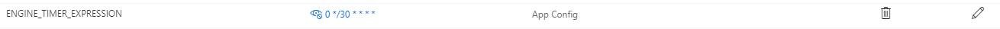

# Bellhop Engine Function
The Bellhop Engine Function is the brains of the operation, and is responsible for orchestrating all of the operations Bellhop performs. 

The engine is written in C# (.NET Core 3.1). By default the Engine will trigger and run on a schedule repeating every 5 minutes. When triggered the Engine will query Azure Resource Graph API for any Azure resources, within the subscription, that have the `"resize-Enable": "True"` tag set. Using Azure Resource Graph avoids querying the ARM API, reducing the likelihood of API throttling.

_Learn more about [Azure Resource Graph](https://docs.microsoft.com/en-us/azure/governance/resource-graph/overview)_

If the Engine finds resources that have the tag set to `True`, it then evaluates the remainder of the resources tags to determine:
- If a scaling operation should occur
    - Determined via `"resize-StartTime"` and `resize-EndTime"` tags.
    - If the current time (UTC) is _between_ `"resize-StartTime"` and `resize-EndTime"`, the resource is scaled **down**.
    - If the current time (UTC) is _outside_ `"resize-StartTime"` and `resize-EndTime"`, the resource is scaled **up** to it's previous state.
- Sends the proper scale message to the storage queue


## Format of Message to Storage Queue

```
{
    "debug": false, // Value from debugEnabled flag in App Configuration
    "direction": "down", // Determined by evaluating startTime and endTime tags
    "tagMap": {
        "enable": "<ENABLE-TAG-FORMAT>",
        "start": "<START-TAG-FORMAT>",
        "end": "<END-TAG-FORMAT>",
        "set": "<SET-PREFIX-FORMAT>",
        "save": "<SAVE-PREFIX-FORMAT>"
    },
    "graphResults": {
        // Resource Graph results for target resource
    }
}
```
NOTE: Optional Custom Tag Values are set during deployment, default values are provided.

## Adjusting the Bellhop Engine Interval

The interval at which the Bellhop engine runs is set by the Application Setting 'ENGINE_TIMER_EXPRESSION'



- The Application Settings for the Function can be found here
    - &lt;deployment prefix&gt;-rg &rarr; &lt;deployment prefix&gt;-function-engine &rarr; Configuration &rarr; 'ENGINE_TIMER_EXPRESSION'
- This value should be a valid NCRONTAB expression.
- More details on NCRONTAB expressions can be found [here](https://docs.microsoft.com/en-us/azure/azure-functions/functions-bindings-timer?tabs=csharp#ncrontab-expressions)
